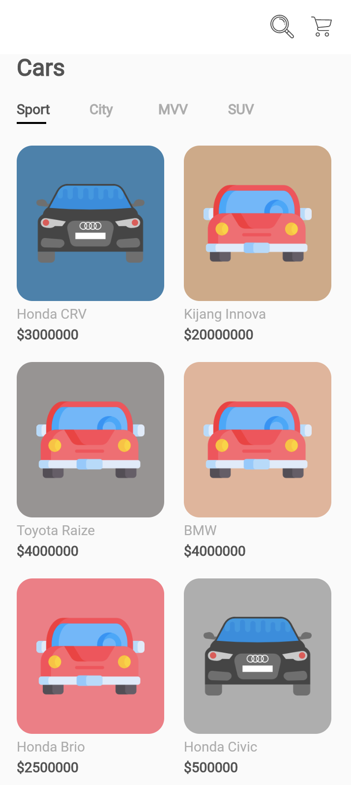
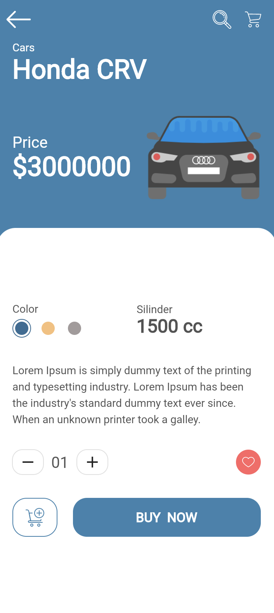

## Important 

This project is still on very early development stage. If you want to use for production, use it with your own risk.
<br>More feature Coming Really Soon.

## BarBar Food

Shop Cars 

## Screenshots

<p float="left">
  

  
</p>

## Fitures

- Choose Cars
- Counter Cars


## Tech Stack

- Flutterfor the Mobile Frontend

## Installation & Configuration

follow these steps to install

### Frontend

```bash
git clone https://github.com/ilhamdani97/shop-cars-flutter.git
cd shop-cars-flutter
flutter run

```
### Support Us :)

- Stars this repository
- Hire Us

  * [Ilham Ramadani](https://www.linkedin.com/in/ilham-ramadani-a38256117/)
  ## Contact

- WA/TELEGRAM: +62 1372374345 (Ilham Ramadani)